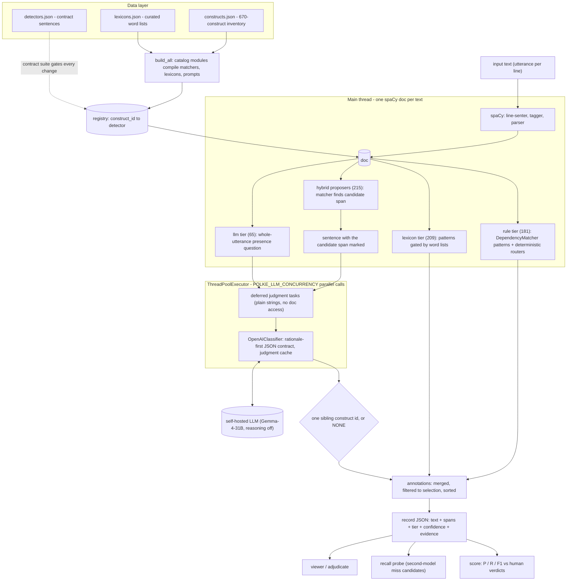

# How POLKE detects grammatical constructions: the NLP/LLM pipeline

Technical companion to `docs/constructions.md` (what is detected) and
`docs/verification-methodology.md` (how well). This document describes the
machinery. `polke explain <IDS>` prints the live configuration — patterns,
lexicons, prompts, contract sentences — for any construct.

## Pipeline at a glance

A rendered copy of this diagram is in `docs/pipeline.svg` (for slides/paper).
Offline tiers (rule, lexicon) finish at the merge directly; only the 280
LLM-gated constructs take the deferred-task path through the thread pool.
Spans always originate from the parser side (left), never from the model.

## 1. Data layer: three JSON files are the single source of truth

| file | role |
|---|---|
| `polke/data/constructs.json` | the inventory: 670 constructs with id, name, category/part/family, definition, example, CEFR level, detector tier, provenance (EGP; GSWE/C&M gap analysis) |
| `polke/data/detectors.json` | the executable contract: per construct, curated positive and negative sentences (~1,200/~2,600). `tests/test_contract.py` runs one test per construct: every positive must fire, no negative may fire |
| `polke/data/lexicons.json` | curated word/phrase lists that gate the lexicon tiers |

## 2. Linguistic foundation

A spaCy pipeline (`en_core_web_sm` by default, `POLKE_SPACY_MODEL` to swap)
provides tokenisation, POS/morphology, lemmas, and the dependency parse that
all structural matching runs over. For transcribed speech, `--by-line` /
`POLKE_SEGMENT=line` inserts a component before the parser that forces one
sentence per input line, so the corpus utterance - not a punctuation-guessed
sentence - is the annotation unit; all downstream stages (detection, the
viewer, the recall probe) share that segmentation.

## 3. Build and registry

`polke.build.build_all(nlp, llm_client)` imports one catalog module per
category (`polke/detectors/catalog/{pas,rel,vta,...}.py`); each module
constructs detector objects wired with compiled matchers, lexicon sets, and
prompts, and registers them in a process-wide registry mapping
`construct_id -> detector`. One detector may serve a *group* of sibling
constructs (see routers below), so the registry has 670 keys but fewer
objects. Every detector implements `match(doc) -> list[Annotation]`;
LLM-stage detectors additionally implement the deferred-judgment interface
(§6).

## 4. The offline tiers (390 constructs, no model calls)

**`rule` (181 constructs).** spaCy `DependencyMatcher` patterns over the
parse: each pattern names an anchor token and relational constraints
(dependency label, POS/TAG/morph, lemma, linear order operators such as
`>++` for post-head modifiers). Variants:

- `DependencyRuleDetector` - one pattern, one construct; the matched tokens
  (often widened to the anchor's auxiliary chain: `aux/auxpass/prt/neg`
  children) become the annotated span.
- `RuleRoutingDetector` - one *form* pattern shared by a group of siblings
  plus a deterministic `classify()` written in code: when the choice among
  siblings is itself decidable by form (aux-chain tense/aspect, particle
  type, clause shape), no model is needed and a span is emitted for at most
  one sibling.
- `CompositeDetector` - conjunction/sequencing of sub-detectors for
  constructs with multi-part evidence.
- A spoken-grammar family (`polke/detectors/spoken.py`) for interactional
  structure that is positional rather than dependency-shaped:
  freestanding units, turn-initial markers, delimited inserts,
  medial/final parentheticals, vocatives, final tags, and literal token
  sequences - these match over token positions, turn boundaries, and
  punctuation-free utterance layouts.

**`lexicon` (209 constructs).** The same structural machinery gated by
curated lists from `lexicons.json`:

- `LexiconDetector` - a dependency pattern whose key token (usually the
  lemma) must be in the construct's lexicon (e.g. subject-control verbs).
- `PhraseLexiconDetector` - multi-word expressions matched as phrases
  (e.g. discourse markers, fixed bundles).
- `LexiconRuleDetector` - a lexicon-gated pattern whose table also decides
  *which* sibling id to assign, so one verb-pattern table drives a group.

Offline tiers are deterministic: same input, same output, no network.

## 5. The LLM tiers (280 constructs)

Used where the *form* is detectable but the *reading* is not decidable
structurally (tense/aspect USES, article functions, conditional subtypes),
or where no reliable structural trigger exists at all.

**`hybrid_rule_llm` (209) and `hybrid_lexicon_llm` (6):
`LLMReadingDetector`.** Two stages:

1. *Propose (offline)*: a dependency/lexicon matcher finds a candidate span
   exactly as in §4.
2. *Judge (LLM)*: the sentence is presented with the span marked
   (`... [[was broken]] ...`) together with a group-specific system prompt
   enumerating the sibling constructs with definitional glosses and
   boundary exclusions ("comma-separated coordinated adjectives are a
   different construct - return NONE"). The model returns exactly one
   construct id from the group, or NONE. The span always comes from stage
   1, never from the model, so offsets are parser-exact.

**`llm` (65): `LLMStandaloneDetector`.** No structural gate: the model
judges presence of the construct over the sentence/utterance directly; the
annotation carries the sentence span. Detectors with `wants_context=True`
receive preceding utterances for discourse-level judgments.

**The client (`OpenAIClassifier`).** One chat completion per judgment:
system prompt (detector-specific) + a uniform output contract appended at
the client level - rationale-first JSON (`{"rationale": ...,
"construct_id": <menu with construct names, or NONE>, "confidence": ...}`),
so the model reasons before committing and no per-detector prompt can omit
the schema. Temperature 0, JSON mode, bounded tokens
(`POLKE_LLM_MAX_TOKENS`, default 300). A per-(model, labels, system, user)
cache deduplicates identical judgments. Any OpenAI-compatible server works
(`OPENAI_BASE_URL`); for self-hosted reasoning models
`POLKE_LLM_NO_THINK=1` disables serving-layer thinking. Production runs use
a self-hosted Gemma-4-31B with reasoning off, selected by contract-suite
bake-off. Without a usable model the LLM tiers degrade to a `NullClient`:
offline tiers annotate normally, LLM-tier constructs produce nothing, and a
startup warning says so.

## 6. Orchestration and concurrency

`Annotator.annotate(text, selection, context, progress)`:

1. resolve the selection (category prefixes / ids) against the registry;
2. parse the text once (one spaCy doc);
3. run every offline detector inline on the main thread;
4. ask every LLM-stage detector for its *pending judgment tasks*
   (`llm_tasks(doc)`): stage-1 proposal runs on the main thread (it touches
   the doc), and each task closes over plain strings only;
5. execute all tasks on a `ThreadPoolExecutor`
   (`POLKE_LLM_CONCURRENCY`, default 8; the cluster's measured saturation
   point in production was 32), reporting `progress(done, total)`;
6. merge, filter to the selection, sort by span.

A typical conversational utterance triggers ~130 LLM judgments across the
280 gated constructs; the thread pool, the judgment cache, and server-side
continuous batching make this tractable (~6 s/utterance at concurrency 32
against a single 31B-model server).

## 7. Output schema

Every annotation records: `construct_id`, span (char + token offsets),
`detector_type` (the tier), detector `version`, `confidence` (1.0 for
offline tiers; the model's stated confidence for LLM tiers), `model` (null
offline), and `evidence` (matched text, and the LLM's rationale where one
exists). Records embed the source text so downstream tools (viewer,
probe, scorer) are self-contained.

## 8. Quality machinery around the pipeline

- the per-construct **contract suite** (§1) gates every change and doubles
  as the acceptance benchmark for candidate LLM backends;
- `polke explain` exposes each construct's mechanism for inspection;
- known rule-stage gaps are documented in `docs/detector_gaps.md` (18
  constructs whose proposal patterns miss some realisations - lower-bound
  frequencies);
- end-to-end quality on spoken data is established by human adjudication
  (`docs/verification-methodology.md`): P 0.824 / R 0.676 (upper bound) /
  F1 0.743.
